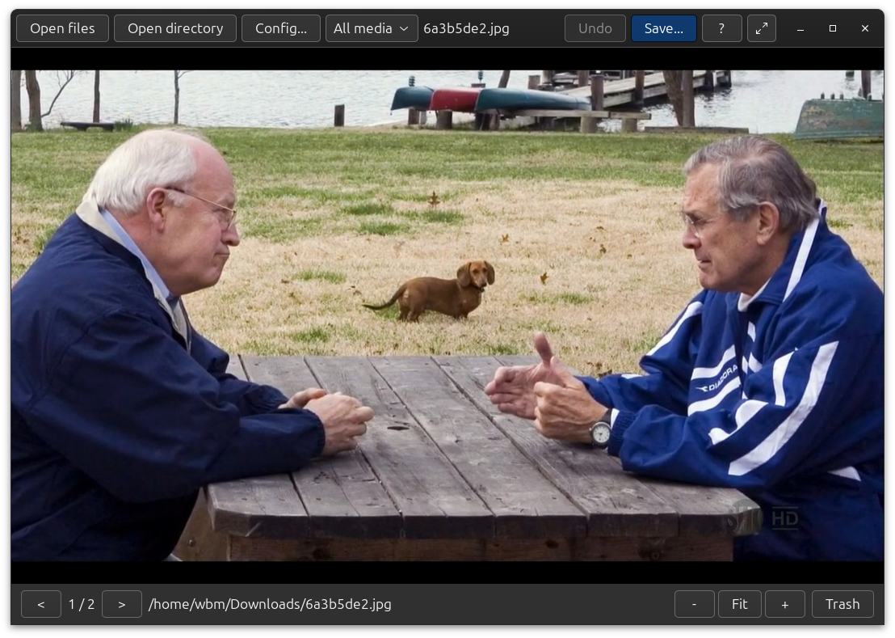

# Mordant

Mordant is a GTK4 media viewer for images and videos which can save media to multiple selected directories at once. Broadly the aim of Mordant is to provide an ergonomic interface for sorting through a large quantity of media files briskly while providing a capable media viewer.

PNG, JPEG, GIF, WEBP, SVG, and diverse video formats are supported. When saving, images and videos are saved in their original format and video screenshots are saved separately. The save dialogue provides multiple directory destinations, copy or move operations, recent directories, and one-step undo functionality.

Recent save directories can be ordered by their full paths, by their final directory names, or by most recent use. Destinations can be filtered live as search text is entered in a search field.

Video playback is provided by the GTK media backend, with supported codecs determined by GStreamer plugins installed. Pillow renders raster images and WEBP, librsvg renders SVG, and `python3-gi-cairo` renders Cairo drawing.



## Setup

```bash
sudo apt install python3-venv python3-setuptools python3-wheel python3-docopt \
    python3-pil python3-cairo python3-gi python3-gi-cairo \
    gir1.2-gtk-4.0 gir1.2-rsvg-2.0 libgtk-4-media-gstreamer \
    gstreamer1.0-plugins-base gstreamer1.0-plugins-good \
    gstreamer1.0-plugins-bad gstreamer1.0-libav desktop-file-utils
```

The programme can be run from a cloned copy of the repository or installed.

## System installation

```bash
sudo ./install.sh --system
```

## User installation (installation to Python virtual environment)

```bash
./install.sh --user
```

|Item               |User installation                                                       |System installation                                                      |
|-------------------|------------------------------------------------------------------------|-------------------------------------------------------------------------|
|Executable         |`~/.local/bin/mordant`                                                  |`/usr/local/bin/mordant`                                                 |
|Virtual environment|`~/.local/share/mordant/venv`                                           |`/opt/mordant/venv`                                                      |
|Desktop entry      |`~/.local/share/applications/io.github.wdbm.mordant.desktop`            |`/usr/local/share/applications/io.github.wdbm.mordant.desktop`           |
|D-Bus service      |`~/.local/share/dbus-1/services/io.github.wdbm.mordant.service`         |`/usr/local/share/dbus-1/services/io.github.wdbm.mordant.service`        |
|Icon               |`~/.local/share/icons/hicolor/scalable/apps/io.github.wdbm.mordant.svg` |`/usr/local/share/icons/hicolor/scalable/apps/io.github.wdbm.mordant.svg`|

For a user installation, the `--prefix` command line option is available for specification of an directory path, e.g.:

```bash
./install.sh --user --prefix /absolute_directory_path_disposable_installation
/absolute_directory_path_disposable_installation/bin/mordant --version
```

All installed files are then kept beneath that prefix. The desktop files and virtual environment contain the actual absolute path, so the result is an executable validation installation rather than a relocatable package.

## Viewer controls

|Cause                               |Effect                                                        |
|------------------------------------|--------------------------------------------------------------|
|`A` / `Z` or `Page Up` / `Page Down`|Show the previous or next file                                |
|`Left` / `Right`                    |Browse images, or seek videos backward or forward by 5 seconds|
|`Shift+Left` / `Shift+Right`        |Seek videos backward or forward by 3 seconds                  |
|`Ctrl+Left` / `Ctrl+Right`          |Seek videos backward or forward by 1 minute                   |
|Mouse wheel, `+`, `=`, `-`          |Zoom an image at the pointer, or zoom in and out              |
|`Ctrl+0`                            |Fit the image to the window                                   |
|Left-click and drag                 |Pan a zoomed image                                            |
|`Space`                             |Open the save dialogue for an image, or play or pause a video |
|`P`                                 |Play or pause a video or animated image                       |
|`S`                                 |Open the save dialogue for the original media file            |
|`Shift+S`                           |Save the current video frame as a PNG screenshot              |
|`Ctrl+S`                            |Quick-save to the selected or most recent save directory      |
|`1`-`9`, `0`                        |Quick-save to the corresponding indexed recent directory      |
|`Ctrl+Z`                            |Confirm undo of the latest save or move operation             |
|`Delete`                            |Move the current original file to the system Trash            |
|`Ctrl+O`                            |Open one or more media files                                  |
|`Ctrl+Shift+O`                      |Open a media directory                                        |
|`F5`                                |Refresh the current directory or explicit file list           |
|`V` / `Shift+V`                     |Toggle or cycle video subtitles                               |
|`F`, `F11`, or double left-click    |Toggle fullscreen mode                                        |
|`Tab`                               |Show or hide controls while in fullscreen mode                |
|`H`                                 |Show or hide the path and status bar                          |
|`F1` / `?`                          |Show the keyboard shortcuts window                            |
|`Escape`                            |Leave fullscreen mode, or close                               |

### Save dialogue controls

|Cause                         |Effect                                                                      |
|------------------------------|----------------------------------------------------------------------------|
|`Enter`                       |Save to all selected directories, except while typing in search             |
|`Escape`                      |Clear an active search while typing in it, otherwise close the save dialogue|
|`1`-`9`, `0`                  |Select or deselect the corresponding displayed directory                    |
|`Alt+1`-`Alt+9`, `Alt+0`      |Save immediately to the corresponding displayed directory                   |
|Right-click a directory button|Offer to remove that entry from recent directories                          |

The search facility searches through previously-selected directories, it does not search the filesystem.

Directories can be displayed listed alphabetically by final directory name, alphabetically by full path, or by most recently used.

The numbered shortcuts select according to the current directory ordering displayed and `0` selects the tenth directory displayed. While searching, the numbered correspond to the filtered results.

## Configuration directories

The default configuration is at `~/.config/mordant` (`"${XDG_CONFIG_HOME}"/mordant`). A new configuration starts with no saved destinations while existing configurations define their own `recent_directories.json`. A configuration can be selected from the command line:

```bash
mordant --config-directory=/path_to_configuration_for_videos
```

The button `Config...` presents for selection up to five most recently-used configuration directories and allows the selection of another directory.
